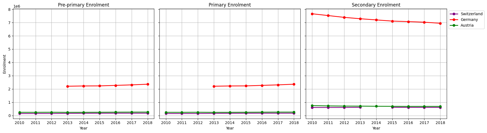
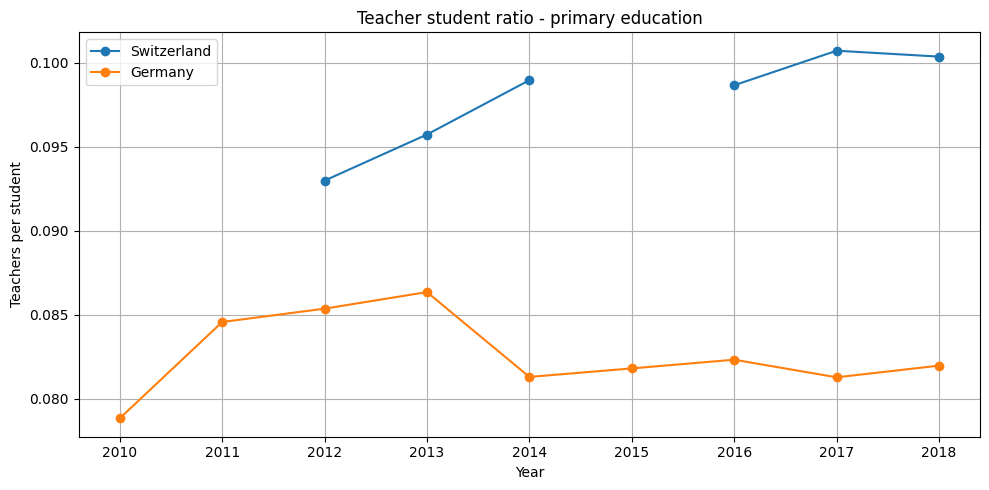
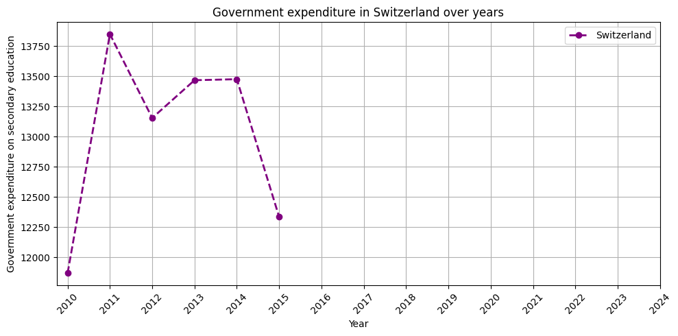

# 📊 Project Findings — Global Education & Demographic Data Analysis

## 🌍 Overview

This analysis explored patterns across international **education and demographic data**, combining country-level information with education indicators covering enrolment, teachers, literacy and government expenditure.

The project focused on transforming raw datasets into interpretable insights through **data cleaning, integration, aggregation, comparative analysis and visualisation**.

The findings below summarise the main patterns identified during the analysis.

---

# 🇩🇪 🇨🇭 🇦🇹 Finding 1 — Education Enrolment Across DACH Countries

Student enrolment was compared across:

- 🇩🇪 Germany
- 🇨🇭 Switzerland
- 🇦🇹 Austria

for three education levels:

- Pre-primary
- Primary
- Secondary



### 🔍 Key Observation

Germany recorded substantially higher absolute enrolment than Switzerland and Austria across all three education levels.

Pre-primary and primary enrolment remained relatively stable across the available years.

The clearest trend appeared in **secondary education**, where Germany showed a gradual decline in enrolment over the analysed period.

### 💡 Interpretation

The comparison demonstrates the importance of considering **country size when interpreting absolute education statistics**.

Germany's higher enrolment totals should not automatically be interpreted as stronger educational participation because Germany also has a substantially larger population.

A useful extension would therefore be to compare:

```text
Students Enrolled
        ÷
Relevant Population
        =
Normalised Enrolment Rate
```

rather than relying exclusively on absolute enrolment.

---

# 👩‍🏫 Finding 2 — Teacher-to-Student Ratios Provide More Context

Teacher and student enrolment datasets were reshaped and merged using:

```text
Country
+
ISO Code
+
Year
+
Education Level
```

This allowed teacher-to-student and student-to-teacher ratios to be calculated for Germany and Switzerland across different education levels.



### 🔍 Key Observation

Absolute teacher or student counts alone provide limited information about the relative availability of teaching resources.

Creating a ratio makes the comparison more interpretable because teacher availability is evaluated relative to the number of enrolled students.

### 💡 Interpretation

This demonstrates an important analytical principle:

> **Derived metrics can often provide more meaningful comparisons than raw totals.**

The analysis therefore moved beyond simply reporting the number of teachers or students and created a metric that better represents the relationship between the two variables.

---

# 💰 Finding 3 — Swiss Education Expenditure Was Relatively Stable

Government expenditure on secondary education was analysed over time for Switzerland.



### 🔍 Key Observation

The available data showed relatively stable expenditure across the analysed period, with moderate year-to-year fluctuations rather than a clear long-term increase or decrease.

### 💡 Interpretation

Time-series analysis makes it possible to distinguish between:

```text
Short-Term Variation
        vs
Long-Term Direction
```

In this case, the observed fluctuations did not indicate a strong sustained trend in either direction within the available data.

---

# 📚 Finding 4 — Global Literacy Can Be Analysed as a Time Series

Adult literacy observations were extracted from the wider education dataset and aggregated by year.

Average literacy values across available countries were then calculated to investigate how reported literacy changed over time.

### 💡 Interpretation

This analysis demonstrated how a large multi-indicator dataset can be filtered to isolate one specific question.

However, changes in the calculated global average should be interpreted carefully because **the countries with available literacy observations can differ between years**.

This means that changes in the average may reflect both:

```text
Changes in Literacy
        +
Changes in Data Availability
```

rather than a perfectly consistent global sample.

---

# 🌐 Finding 5 — Population Density Varies Substantially by Region

Population and land-area information were combined to calculate:

```text
Population Density
=
Population ÷ Land Area
```

Countries were then classified and ranked within their respective regions.

Using Pandas `groupby()` operations, the analysis identified the countries with the highest calculated population density within each region.

### 💡 Interpretation

Population alone does not describe how geographically concentrated a country's population is.

Two countries can have similar populations but very different land areas, resulting in substantially different population densities.

This demonstrates the value of **feature engineering**: combining two existing variables created a new metric that provided additional analytical information.

---

# 📖 Finding 6 — Literacy & Population Data Can Be Combined to Estimate Scale

Literacy information was integrated with country population data to estimate the potential scale of adult illiteracy.

The analysis used:

```text
Illiteracy Rate
=
100 − Literacy Rate
```

and an assumed adult population share between:

```text
65% – 80%
```

to estimate a range for the number of adults potentially affected.

### 💡 Interpretation

This analysis demonstrates how percentages can be translated into more tangible population estimates.

For example:

```text
Literacy Percentage
        ↓
Illiteracy Percentage
        ↓
Population Estimate
        ↓
Estimated Number of People
```

This can make an abstract percentage easier to interpret from a policy or resource-planning perspective.

### ⚠️ Important Limitation

The result is an **estimate rather than an observed count** because the analysis assumes that adults represent between 65% and 80% of each country's total population.

The resulting values should therefore be interpreted as approximate ranges.

---

# 📈 Finding 7 — Land Area Alone Is Not Enough to Explain Primary Enrolment

Country land-area information was merged with primary-school enrolment data to investigate whether geographically larger countries also tended to have higher student enrolment.

A correlation analysis and scatter plot were used to investigate the relationship.

### 💡 Interpretation

Land area by itself is not an intuitive explanation for education demand.

A geographically large country can have a relatively small population, while a geographically small country can have a highly concentrated population.

Variables such as:

- population size
- age distribution
- birth rates
- participation rates
- urbanisation

would provide additional context for understanding differences in student enrolment.

This analysis demonstrates why **correlation should be interpreted in the context of the underlying variables rather than treated as evidence of causation**.

---

# 🧹 Finding 8 — Data Preparation Was Central to the Analysis

One of the most important findings from the project was methodological rather than country-specific.

The original datasets could not simply be combined and analysed immediately.

Several preprocessing steps were required:

```text
Raw Data
   ↓
Country Validation
   ↓
Missing-Value Handling
   ↓
Duplicate Removal
   ↓
Data-Type Conversion
   ↓
Column Standardisation
   ↓
Wide-to-Long Transformation
   ↓
Dataset Integration
   ↓
Analysis
```

### 💡 Key Takeaway

A substantial proportion of real data analysis happens **before statistical analysis or visualisation begins**.

The project required country names and identifiers to be aligned, missing values to be handled and year columns to be transformed before reliable cross-dataset comparisons could be performed.

---

# 🔄 Finding 9 — Reshaping Data Enabled More Flexible Analysis

The original education data contained year information across multiple columns.

Using:

```python
pd.melt()
```

allowed the dataset to be transformed from wide to long format.

This created a structure closer to:

```text
Country | Indicator | Year | Value
```

rather than:

```text
Country | 2010 | 2011 | 2012 | 2013 | ...
```

### 💡 Why This Matters

Long-format data made it substantially easier to:

- filter by year
- compare countries
- group observations
- calculate ratios
- create time-series plots
- merge related indicators

This became particularly important for the teacher-to-student and cross-country analyses.

---

# 🔗 Finding 10 — Multiple Datasets Provide More Useful Insights Together

Several of the strongest analyses required combining information that originally existed in different datasets.

Examples included:

```text
Population + Land Area
→ Population Density

Literacy + Population
→ Estimated Illiterate Population

Teachers + Enrolment
→ Teacher-to-Student Ratio

Land Area + Primary Enrolment
→ Correlation Analysis
```

### 💡 Key Takeaway

The project demonstrates that the value of data often increases when **separate sources are connected through shared identifiers**.

Rather than analysing every dataset independently, merging related information enabled the creation of new metrics and more meaningful questions.

---

# 📊 Overall Analytical Findings

Across the project, several broader analytical lessons emerged.

### 🧹 Data Quality Matters

Missing observations, inconsistent structures and incompatible data types can materially affect downstream analysis.

### 🔗 Integration Creates New Information

Combining datasets allowed new metrics to be calculated that were not available directly in either source.

### 📐 Normalisation Matters for Country Comparisons

Absolute values can be misleading when comparing countries with very different population sizes.

### 📈 Trends Require Context

Time-series movements should be interpreted alongside data availability and changes in the underlying sample.

### 🔎 Correlation ≠ Causation

A statistical relationship between two variables does not necessarily mean that one causes the other.

### 💡 Derived Metrics Can Be More Informative

Measures such as population density and teacher-to-student ratios can provide more useful context than raw totals.

---

# ⚠️ Limitations

Several limitations should be considered when interpreting the results.

### Missing Data

Not every education indicator was available for every country and year.

As a result, different analyses may contain different subsets of countries.

### Country Size

Absolute education statistics are heavily influenced by population size.

Direct comparisons between countries should therefore be interpreted cautiously.

### Time Coverage

The available time period differs across some indicators, limiting direct comparisons.

### Estimated Adult Population

The literacy/population analysis uses an assumed adult population share of **65%–80%**, meaning the resulting estimates are approximate.

### Historical Data

The project uses the datasets available during the original analysis and should not be interpreted as representing current education conditions.

---

# 🚀 Future Analysis

The project could be extended by incorporating:

- 📅 more recent education data
- 👥 population-adjusted enrolment rates
- 💰 education expenditure per student
- 👩‍🏫 students per teacher
- 🌍 regional benchmarking
- 📊 interactive Power BI dashboards
- 🗺️ geographic visualisations
- 🤖 clustering of countries by education characteristics
- 📈 predictive modelling of selected education indicators

A future dashboard could allow users to interactively explore:

```text
Country
   │
   ├── Population
   ├── Literacy
   ├── Enrolment
   ├── Teacher Availability
   ├── Education Expenditure
   └── Regional Comparison
```

---

# 🎯 Overall Conclusion

The project demonstrates an end-to-end Python data-analysis workflow:

```text
Raw Data
   ↓
Cleaning
   ↓
Transformation
   ↓
Integration
   ↓
Feature Engineering
   ↓
Exploratory Analysis
   ↓
Visualisation
   ↓
Interpretation
```

The strongest analytical lesson was that **meaningful comparison requires context**.

Absolute education values alone can be difficult to interpret across countries of very different sizes. Derived measures, integrated datasets and appropriately normalised metrics can provide substantially more useful information.

From a technical perspective, the project strengthened my ability to use **Pandas for cleaning, reshaping, merging, grouping and analysing multiple datasets**, while Matplotlib was used to communicate the resulting patterns visually.

---

# 🎓 Academic Context

Originally developed for **COMP1888 – Programming for Data Science** as part of the MSc Data Science and Its Applications programme at the University of Greenwich.

For this portfolio repository, the project is presented as an end-to-end **Python data analysis and data-wrangling case study**.

---

# 👩🏼‍💻 Author

**Julia Legner**  
MSc Data Science and Its Applications  
University of Greenwich

**Portfolio Focus:** Data Analytics • Python • Pandas • Business Intelligence • Data Science
